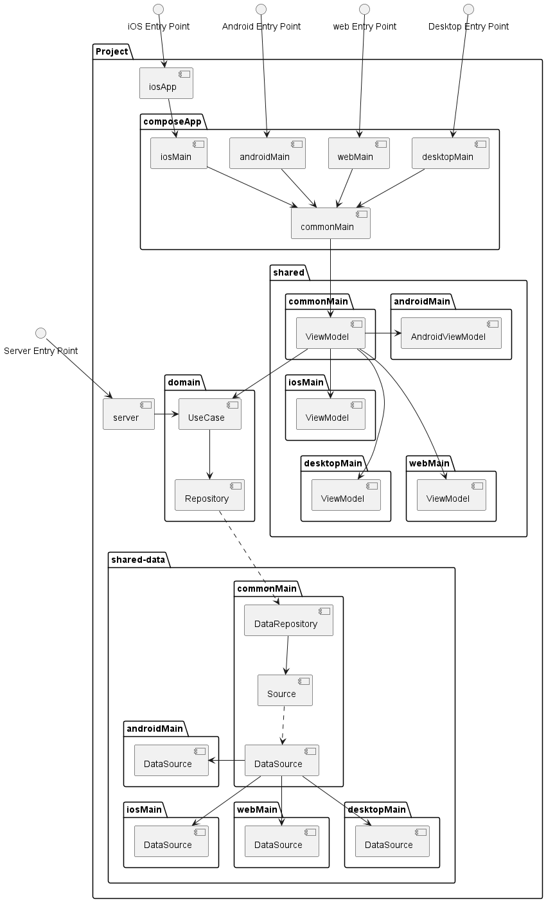

# Kotlin Multiplatform Playground

This is a Kotlin Multiplatform project targeting Android, iOS, Web, Desktop, Server.

## Kotlin Multiplatform with Compose Multiplatform (Main Structure)

## Main Goal for Architecture (Status: Work in Progress)

## Folders

* `/composeApp` is for code that will be shared across your Compose Multiplatform applications.
  It contains several subfolders:
  - `commonMain` is for code that’s common for all targets.
  - Other folders are for Kotlin code that will be compiled for only the platform indicated in the folder name.
    For example, if you want to use Apple’s CoreCrypto for the iOS part of your Kotlin app,
    `iosMain` would be the right folder for such calls.

* `/iosApp` contains iOS applications. Even if you’re sharing your UI with Compose Multiplatform, 
  you need this entry point for your iOS app. This is also where you should add SwiftUI code for your project.

* `/server` is for the Ktor server application.

* `/shared` is for the code that will be shared between all targets in the project.
  The most important subfolder is `commonMain`. If preferred, you can add code to the platform-specific folders here too.
  This is being used as the main `/shared` folder.

* `/domain` is a shared module where it is responsible on creating the business logic. You usually don't
need to add code to the platform-specific but you can add additional business logic depending on the target

* `/data` is a shared module where it is responsible for fetching the data. You can fetch platform-specific
data.

**Note:** Compose/Web is Experimental and may be changed at any time. Use it only for evaluation purposes.